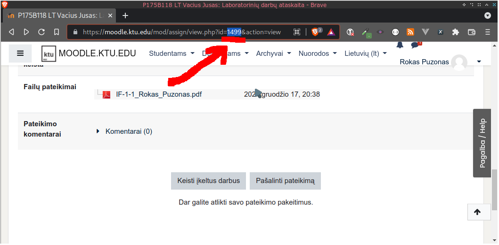

# KTU Moodle assignment upload

This will automatically open up moodle and upload/update any assignment file.

It works by using selenium to access the moodle website by emulating what a
normal person would do.

## Why?
So I could use this together with ["KTU OOP Report Generator"](https://github.com/RokasPuzonas/ktu-oop-report-generator)
and [Github Actions](https://github.com/features/actions) to automatically generate
a report and upload it to moodle whenever I push a commit or tag.

And also because I love automating everyday tasks.

## Usage

1. Clone repository
```shell
git clone https://github.com/RokasPuzonas/ktu-moodle-assignment-upload
```

2. Setup [virtualenv](https://pythonbasics.org/virtualenv)
```shell
python -m venv venv
```

4. Active enviroment
```shell
source venv/bin/activate
```

4. Install dependencies
```shell
pip install -r requirements.txt
```

5. Determine your assignment
For this script to work, it needs to know to what assignment you want to upload
the file. Luckily this is super simple to do, just open up the webpage where
the you can view the assignment and take a look at the url.



6. That's it, you're done!
Now you can run the script!

```shell
./main.py <assignment-id> <filename> <upload-filename> --username <username> --password <password>
```

## Example

```shell
./main.py 1610 report.pdf IF-1-1_Bob_Bobby.pdf --username bob --password ilovecats
```

